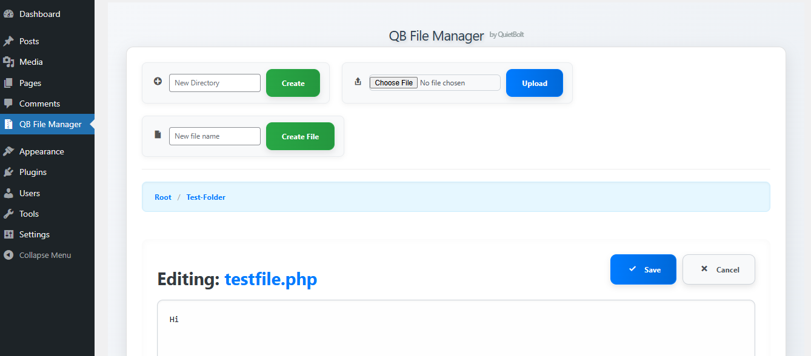
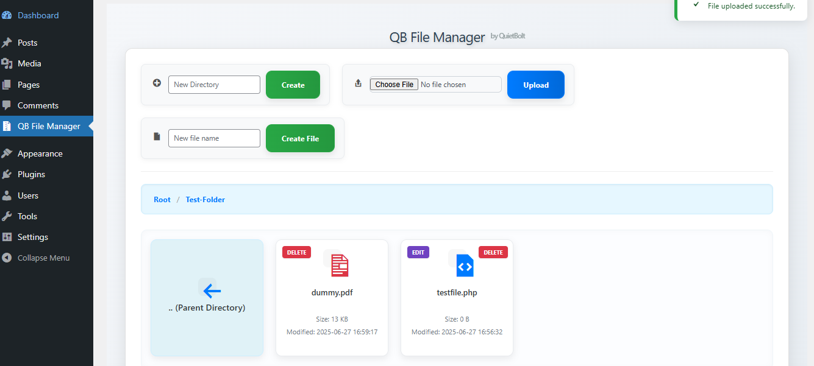

# QB File Manager by QuietBolt

A clean and powerful admin file manager plugin for WordPress. Easily browse folders, create and edit files, upload assets, and manage everything from the WordPress dashboard — no FTP required.

## 🔧 Features

- 📁 Folder browsing from WordPress root directory  
- 🗂️ Create new folders  
- 📄 Create and edit files  
- 📤 Upload any file  
- 🗑️ Delete files and folders  
- ✅ Simple, modern UI  
- 🔒 Administrator-only access  

## 🧩 Supported File Types

**Editable:**  
`php`, `html`, `css`, `js`, `txt`, `json`, `xml`, `md`, `log`, `ini`, `.htaccess`, `svg`, `csv`, `yml`

**Images:**  
`jpg`, `jpeg`, `png`, `gif`, `webp`, `ico`, `bmp`

**PDF:**  
`pdf`

**Archives:**  
`zip`, `tar`, `gz`, `rar`

## 🔒 Security

- Only accessible by `administrator` role  
- File operations are restricted to the WordPress root directory  
- Sanitized file paths and input handling  
- No frontend or public exposure

## 📸 Screenshots

1. Folder browser UI 
 
2. File editor view  

3. Upload and create file dialogs 
 

> Screenshots are located in the plugin root and used for WordPress.org listing.

## 🚀 Installation

1. Upload the plugin folder to `/wp-content/plugins/qb-file-manager/`
2. Activate the plugin via **Plugins > Installed Plugins**
3. Go to **QB File Manager** in the WordPress dashboard

## 💬 FAQ

**Can it access the entire server?**  
No. It only operates within your WordPress install directory.

**Can I edit code files like PHP and JS?**  
Yes — all common code and config formats are supported.

**Does it preview images or PDFs?**  
No. Files can be managed, not previewed or rendered inside the plugin.

## 📝 License

Released under the [GPLv2 or later](https://www.gnu.org/licenses/gpl-2.0.html)

---

**Author:** [QuietBolt](https://github.com/quietbolt)  
**Repository:** [GitHub - quietbolt/qb-file-manager](https://github.com/quietbolt/qb-file-manager)
